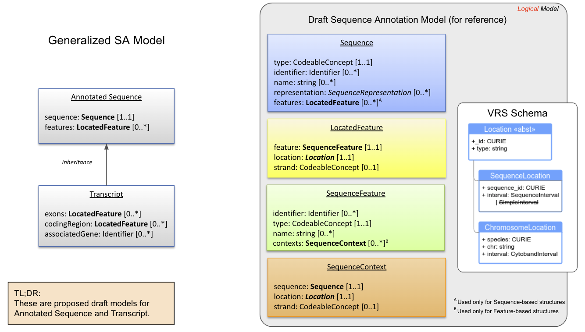

Terminology and Model 
!!!!!!!!!!!!!!!!!!!!!

This is a DRAFT information model that was developed as part of the GA4GH GKS SA subgroup's exercise to model sequence features and transcripts. It is a work in progress.

This information model was derived from the `draft conceptual and logical models <https://docs.google.com/presentation/d/1WdDSpr3XqSt9TXp_iyr2FiCBM4BANbL6JM24H1I6UjE/edit#slide=id.p>`__ that were developed as foundational work for this effort. Please reference those models in addition to this documentation (which is incomplete).

Note: Some elements are sourced from the `Variation Representation Specification (VRS) <https://vrs.ga4gh.org/en/latest/index.html>`__ and others from the `HL7 Clinical Genomics FHIR Molecular Sequence Resource <https://build.fhir.org/branches/cg-im-molseq-work_in_progress/molecularsequence.html>`__. This draft model was aligned to those specifications as much as possible while still achieving the goals of the SA modeling exercise.

.. _schema-temp:

  Current Draft Of Sequence Annotation Schema

   **Legend** Summary of image

Core Classes
@@@@@@@@@@@@

.. _Sequence:

Sequence
########

The definition of Sequence is identical to `VRS Sequence <https://vrs.ga4gh.org/en/stable/terms_and_model.html#sequence>`__.

A *sequence* is a character string representation of a contiguous, linear polymer of nucleic acid or amino acid Residues. Sequences are the prevalent representation of these polymers, particularly in the domain of variant representation.

.. include:: defs/DSAM/Sequence.rst

.. _LocatedFeature:

LocatedFeature
##############

Summary goes here 

.. include:: defs/DSAM/LocatedFeature.rst

.. _SequenceFeature:

SequenceFeature
###############

Summary goes here 

.. include:: defs/DSAM/SequenceFeature.rst

.. _SequenceContext:

SequenceContext
###############

Summary goes here 

.. include:: defs/DSAM/SequenceContext.rst 

.. _Annotated-Sequence:

Annotated Sequence
@@@@@@@@@@@@@@@@@@

An *annotated sequence* is a sequence that contains annotations (e.g., features).

Annotated Sequence
$$$$$$$$$$$$$$$$$$

An *annotated sequence* is a sequence with associated annotations (e.g., features). Structurally, the class is simply a container for a Sequence and located features. This class may serve as a generalized parent class that can be specialized to support complex types of annotated sequences (e.g., transcripts).

.. include:: defs/DSAM/annotatedsequence.rst

.. _Transcript:

Transcript
$$$$$$$$$$

A *transcript* is a type of annotated sequence.

.. include:: defs/DSAM/transcript.rst

